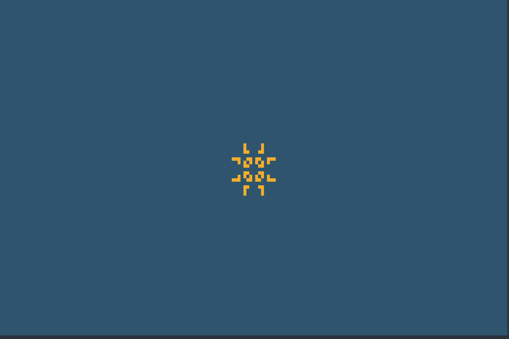

+++
title = 'GLiPy'
date = 2024-02-26T11:28:59-05:00
draft = true
+++



When it comes to software, my focus oscillates between two major states. I am either solving a programming puzzle, or working on a project I've become interested in (often inspired by the puzzle itself). I first encountered _Conway's Game of Life_ while solving this [Advent of Code](https://adventofcode.com/2015/day/18) puzzle (here is [my rust solution](https://github.com/noprobelm/advent-of-code/blob/main/2015/rust/src/bin/18.rs) in case you're interested).

I had been binging these puzzles in the days prior. As soon as I encountered this puzzle, I couldn't help but take a shot at writing my own Cellular Automaton library. The result was `GLiPy`.

Eventually, I hope to rewrite this project in Rust and visualize it using the [Bevy game engine](https://conwaylife.com/patterns/pulsar.rle), but prototyping in Python (literally and figuratively) was a fun and rewarding experience.

## The Rules

The rules of this one-player game are straightforward: in a continuous grid of dead/alive cells, a cell will change its state based on the state of its neighbors:

- A cell which is "dead" will resurrect if it is next to *exactly* 3 live cells
- A cell which is "alive" will survive for the next generation if it is next to *exactly* 2 _or_ 3 live cells. Otherwise, it will die out (as if by under/over population)
- The initial `generation` of cells is considered the _seed_
- Future generations are created by applying the rules for each cell in the grid simultaneously

While simple, the results can be stunning. Here is a random [soup](https://conwaylife.com/wiki/Soup):


Complex patterns can emerge over time, and are often discovered just by generating a random soup




Given these rules, let's write a simple, extensible library in Python.

## The `Coordinate` Class

Before we begin work on the `Cell` class, we need to build a coordinate system throug which we will reference a cell's location. In my opinion, this is exactly what the `dataclass` decorator is useful for

```python
from __future__ import annotations

@dataclass(frozen=True, slots=True)
class Coordinate:
    x: int
    y: int

    def __add__(self, other: Coordinate) -> Coordinate:
        return Coordinate(self.x + other.x, self.y + other.y)

    def __sub__(self, other: Coordinate) -> Coordinate:
        return Coordinate(self.x - other.x, self.y - other.y)

    def __contains__(self, other: Coordinate) -> bool:
        if 0 <= other.x <= self.x and 0 <= other.y <= self.y:
            return True
        return False

```

Since our `Coordinate` class will effectively be immutable, we can pass the `frozen=True` argument to our `dataclass` decorator.

Furthermore, we can anticipate that a given coordinate will exist for the duration of the automaton, so we may as well utilize Python's `slots` future in hopes of a minor memory speedup (in reality, the impact for a class of this size will likely be negligible).

In the body of the class itself, we can include special methods to accommodate adding and subtracting coordinates from each other so we can quickly identify a cell's neighbors.

Lastly, we will use the `__contains__` method to determine whether another coordinate is within range of the grid's bounds.

> **_NOTE:_**  Conway's Game of Life is classically represented as an infinite grid of cells, but GLiPy doesn't reach this scope (yet). Instead, we will compromise by creating a grid that loops to the opposite side to ease the burden of memory considerations within our program.

## The `Cell` Class

Now that we've defined our `Coordinate` class, we can implement it in a `Cell`.

In the interest of extensibility, we should divorce the concept of a cell's _location_ from its _state_. In effect, this will allow us to create new neighborhoods and build states beyond the binary _dead_ and _alive_ representations without compromising the integrity of the base class.

In past projects, I've found that building a base class can be suffociating when we might be basing a wide variety of classes on it. This time, I opted to exercise a __structural subtyping_ pattern through use of Python's `Protocol` class. For those familiar with interface-based programming (e.g., Java's `interface`), you might find this concept welcoming. By using `Protocol`, we can define a set of method and variable signatures to which users must adhere when implementing their own versions of the `Cell` class.


**Caution**: Unlike most languages with interface-based programming patterns, Python will silently allow you to implement classes that were meant to adhere to a protocol. You should use a static type checker like [mypy](https://mypy-lang.org/) to avoid oversights in your implementations.


Let's implement the `Cell` Protocol

```python
from typing import List, Protocol, Tuple

from .coordinate import Coordinate


class Cell(Protocol):
    coord: Coordinate
    neighbors: Tuple[Coordinate, ...]

    def __init__(self, coord: Coordinate) -> None:
		...

    def get_neighbors(self, max_coord: Coordinate) -> List[Coordinate]:
		...
```

Our implementation is incredibly simple. All classes intending to adhere to the `Cell` protocol must implement these attribute and method signatures. Let's break it down

| Attribute            | Method               | Name            | Definition                                                                                                                      |
|:--------------------:|:--------------------:|-----------------|---------------------------------------------------------------------------------------------------------------------------------|
|  |                      | `coord`         | The coordinate of a `Cell`                                                                                                      |
|  |                      | `neighbors`     | The neighbors of a `Cell`                                                                                                       |
|                      |  | `__init__`      | The initialization method for a `Cell` instance. Requires a `coord` arg                                                                                 |
|                      |  | `get_neighbors` | The logic for retrieving the neighbors for a `Cell` instance. Requires a `max_coord` arg to identify the bounds of an automaton |

Though the `Cell` protocol is pretty relaxed as is, we might consider loosening its definitions even further in the future. For example, if we were to implement logic that would allow us to operate in a truly infinite grid of cells, the `max_coord` argument would no longer be relevant. However, given our currently planned implementation of a bounded grid of cells, we should enforce a maximum coordinate restriction.

## The `State` Class

The `CellState` protocol will act as an interface for implementing the ruleset a cell should follow when changing states

```python
from typing import List, Protocol, Self

class CellState(Protocol):
    def change_state(self, neighbors: List[Self]) -> CellState:
		...
```

As you can see, this is an even simpler interface to deal with than what we defined for a `Cell`. A class implementing a `CellState` interface need only define a `change_state` instance method which will accept a list of neighbors and return a _new_ state based on some arbitrary logic the user implements.

## The `Automaton` class

Finally, we can put it all together in the `Automaton` class. Let's talk about some key features (though not all-inclusive) of the `Automaton` class. An `Automaton` instance should include

- Initialization logic to build a basic `Automaton` from either a _default_ state or a set of _predefined_ states (i.e., a 'pattern')
- An `evolve` and `run` method to control single or multi-step evolutions
- A `set_state` method to set the state of a cell at a given coordinate
- A `spawn` method to spawn one `Automaton` inside another. This can particularly useful for adding pre-defined patterns to a matrix of cells in an initial state
- A `clear` method to reset an `Automaton` to its initial state

### Generic Types

No `Automaton` should use more than one type of `Cell` or `CellState`. We can enforce this by implementing generic types at the top of our module. We will associate these with the `Automaton` class signature when we write it.

```python
from typing import TypeVar
from .cell import Cell
from .state import CellState

C = TypeVar("C", bound=Cell)
S = TypeVar("S", bound=CellState)
```

### Cell Neighbors & State Data

When iterating through an automaton's matrix of cells, we want to access the `neighbors` and `state` for each cell. We can consolidate these into their own data type, which we will refer to as `StateData`.

```python
from typing import List
from .coordinate import Coordinate
from .state import CellState

@dataclass
class StateData:
    neighbors: List[Coordinate]
    state: CellState
```

### `Automaton` Class Signature

Now that we've defined our generic types and the subject of each coordinate in the matrix, we can begin writing the `Automaton` class

```python
from typing import Type, Union, Sequence, Generic

class Automaton(Generic[C, S]):
    def __init__(
        self,
        cell_type: Type[Cell],
        initial_state: Union[CellState, Sequence[Sequence[CellState]]],
        xmax: int,
        ymax: int,
    ) -> None:
        self.generation = 0
        self.cell_type = cell_type
        self.xmax = xmax
        self.ymax = ymax

        self.max_coord = Coordinate(self.xmax, self.ymax)
        self.midpoint = Coordinate(self.xmax // 2, self.ymax // 2)

        self.matrix: List[List[StateData]] = []
		self._current_row = 0

        if isinstance(initial_state, list):
            self.state_type = type(initial_state[0][0])
            for y in range(self.ymax + 1):
                self.matrix.append([])
                for x in range(self.xmax + 1):
                    coord = Coordinate(x, y)
                    c = self.cell_type(coord)
                    neighbors = c.get_neighbors(self.max_coord)
                    state = initial_state[y][x]
                    self.matrix[y].append(StateData(neighbors, state))
        else:
            initial_state = cast(CellState, initial_state)
            self.state_type = type(initial_state)
            for y in range(self.ymax + 1):
                self.matrix.append([])
                for x in range(self.xmax + 1):
                    coord = Coordinate(x, y)
                    c = self.cell_type(coord)
                    neighbors = c.get_neighbors(self.max_coord)
                    self.matrix[y].append(StateData(neighbors, initial_state))

```

This is a rather lengthy `__init__`, so let's talk about what's going on here.

After writing our class signature and associating the generic types we assigned at the top of this section (which will be enforced by your static type checker), we define our method's arguments. They are relatively straightforward:

- `cell_type`: Defines the type of cell to be used in the `Automaton` instance. Don't get this confused with the generic cell type, which is primarily used by the static type checker. In our method's body, we will actually initialize instances of the cell type based on our position in the matrix as we build it.
- `initial_state`: This argument can be one of two types
  - A single `CellState` instance, which the matrix will be uniformly filled with.
  - A two-dimensional sequence of `CellStates` (`Sequence[Sequence[CellState]]`) which the matrix will be filled with. This is useful if we have a predefined pattern or random soup we want to simulate.
- `xmax` and `ymax`: The maximum `x` and `y` coordinates of the cell matrix

Now let's walk through the instance variables for this class

- `generation`: The generation our `Automaton` is on (starting at `0`)
- `max_coord`: The maximum coordinate of the grid, based on `xmax` and `ymax`. We will use this with the `__contains__` special method we defined for the `Coordinate` class.
- `midpoint`: The midpoint of the `Automaton`. This is simply a convenience variable for users to spawn a pattern in the middle of an existing grid.
- `matrix`: The underlying cell matrix. This will contain instances of the `StateData` class we defined
- `_current_row`: Later, we'll make `Automaton` an iterator, which will use this variable to keep track of where we are in an iteration.
- `state_type`: The state type associated with the cell matrix. This can be utilized by the user for any purpose, and is also used later by the `clear` method to reset the `Automaton` instance.
- `cell_type`: The cell type associated with the matrix. This can be utilized by the user for any purpose

The rest of our `__init__` method simply fills our matrix with `StateData`.

One thing you'll notice is that as we fill out the initial matrix, we compute and cache the neighbors for a given cell. This will significantly reduce runtime overhead in the future as we iterate through the matrix by alleviating us of the need to calculate the neighbors of a cell each time we visit it.

### `Automaton` evolution logic

With the foundation of our `Automaton` class established, we can write logic for its evolution. This process will follow a few steps:

- Initialize an empty list of lists called `next_generation`. As we iterate through our cell matrix, we'll store the new state for each cell here.
- Iterate through the matrix
  -
```python
def evolve(self) -> None:
	next_generation: List[List[StateData]] = []
	for y in range(self.ymax + 1):
		next_generation.append([])
		for x in range(self.xmax + 1):
			coord = Coordinate(x, y)
			data = self.matrix[coord.y][coord.x]
			neighbor_states = []
			for nc in data.neighbors:
				neighbor_state = self.matrix[nc.y][nc.x].state
				neighbor_states.append(neighbor_state)
			new_state = data.state.change_state(neighbor_states)
			next_generation[y].append(StateData(data.neighbors, new_state))

	self.matrix = next_generation
	self.generation += 1

```
